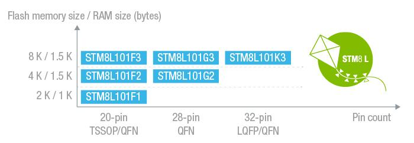
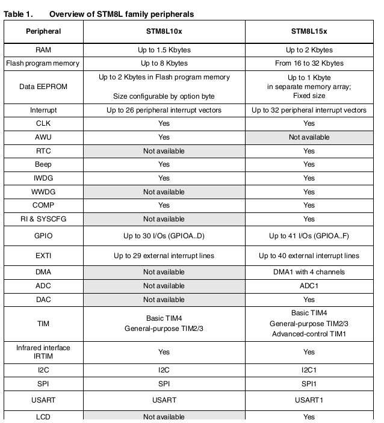

# [STM8L101](https://github.com/sochub/STM8L101) 
 
#### 厂商：[ST](https://github.com/sochub/ST) 
#### 架构：[STM8](https://github.com/sochub/STM8)
#### 收录芯片定级：[Level](https://github.com/sochub/Level)

## [STM8L101描述](https://github.com/sochub/STM8L101/wiki) 

[STM8L101](https://github.com/sochub/STM8L101) 系列

* 最低功耗模式：0.30 uA
* 动态运行模式：150 uA/MHz

 

STM8L101只有HSI和LSI，HSI做为主时钟，LSI时钟的频率也从128Khz变成了38Khz，AWU功能做定时唤醒需要调整延时时间的设置，外设的时钟需要手动开启

AWU（Auto Wakeup Unit）的时钟源是独立的LSI（Low Speed Internal Clock），datasheet显示LSI一致性差（25KHz到75KHz不等）。

### [收录资源](https://github.com/sochub/STM8L101)

* [文档](docs/)
* [资源](src/)
    * [STVD工程资源](src/STVD)
    * [SDCC工程资源](src/SDCC)
    * [IAR工程资源](src/IAR)
    * [demo资源](src/demo)

### [关联资源](https://github.com/sochub)

* [SDCC编译](https://github.com/sochub/sdcc)

### [选型建议](https://github.com/sochub)

[STM8L101](https://github.com/sochub/STM8L101)可替换的方案包括 [STM8L051](https://github.com/sochub/STM8L051) 和 [STM8L151](https://github.com/sochub/STM8L151) 

[STM8L101](https://github.com/sochub/STM8L101)和[STM8L151](https://github.com/sochub/STM8L151)对比：

 

[STM8L101](https://github.com/sochub/STM8L101)和[STM8S103](https://github.com/sochub/STM8S103)对比：供电电压范围更宽功耗更低，裁减了一些外设(WWDG和ADC被裁减)

##  [SoC资源平台](http://www.qitas.cn)  

