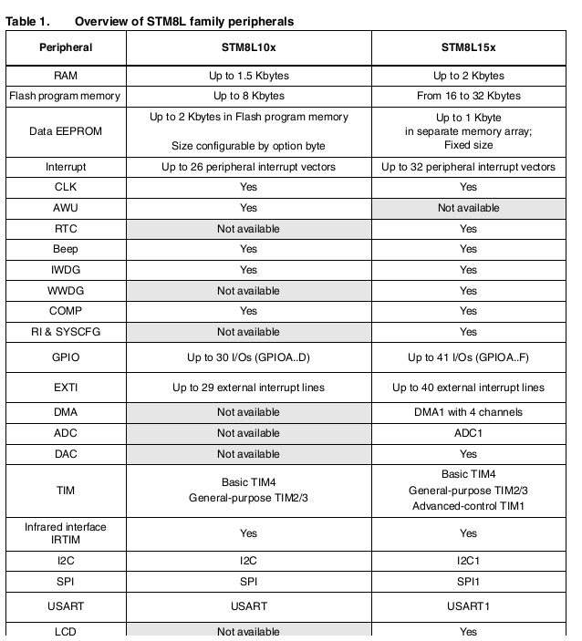

# [STM8L101](https://github.com/SoCXin/STM8L101)

* [ST](https://www.st.com/zh/): [STM8](https://github.com/SoCXin/8051)
* [L1R2](https://github.com/SoCXin/Level): 16 MHz

## [简介](https://github.com/SoCXin/STM8L101/wiki)

[STM8L101](https://github.com/SoCXin/STM8L101)超值超低功耗微控制器为成本敏感型应用提供了最佳性价比。 超值系列具有与STM8L151/152系列类似的内核性能和外设集，优化了特性和配置，从而能够达到预算价格。

STM8L基于8位STM8内核，与STM32L系列一样采用了专有超低漏电流工艺，利用最低功耗模式实现了超低功耗（0.30 uA）

### 关键特性

* 1.5 Kbytes of SRAM

### [资源收录](https://github.com/SoCXin)

* [参考资源](src/)
* [相关文档](docs/)
* [典型应用](project/)

### [选型建议](https://github.com/SoCXin)

[STM8L101](https://github.com/SoCXin/STM8L101)相比[STM8S103](https://github.com/SoCXin/STM8S103)供电电压范围更宽更低功耗，裁减了一些外设(WWDG和ADC被裁减)

#### [STM8L101](https://github.com/SoCXin/STM8L101) VS [STM8L151](https://github.com/SoCXin/STM8L151)

### [探索芯世界 www.SoC.xin](http://www.SoC.Xin)
