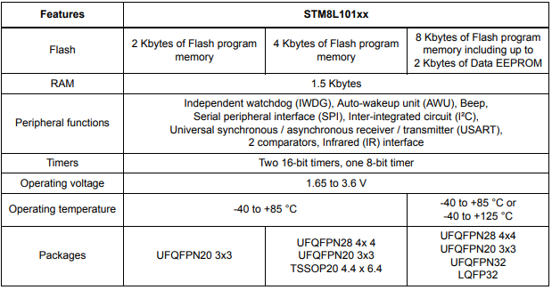

# [STM8L101](https://github.com/SoCXin/STM8L101)

#### [Vendor](https://github.com/SoCXin/Vendor)：[ST](https://github.com/SoCXin/ST)
#### [Core](https://github.com/SoCXin/STM8)：[STM8](https://github.com/SoCXin/STM8)
#### [Level](https://github.com/SoCXin/Level)：16MHz

## [STM8L101描述](https://github.com/SoCXin/STM8L101/wiki)

[STM8L101](https://github.com/SoCXin/STM8L101) 最低功耗模式：0.30 uA,动态运行模式：150 uA/MHz

STM8L101只有HSI和LSI，HSI做为主时钟，LSI时钟的频率也从128Khz变成了38Khz，AWU功能做定时唤醒需要调整延时时间的设置，外设的时钟需要手动开启

AWU（Auto Wakeup Unit）的时钟源是独立的LSI（Low Speed Internal Clock），datasheet显示LSI一致性差（25KHz到75KHz不等）。

### [收录资源](https://github.com/SoCXin/STM8L101)

* [文档](docs/)
* [资源](src/)

#### [开发工具](https://github.com/SoCXin)

* [STM8CubeMX](https://www.st.com/zh/development-tools/stm8cubemx.html)
* [SDCC编译器](http://sdcc.sourceforge.net/)

### [选型建议](https://github.com/SoCXin)

[STM8L101](https://github.com/SoCXin/STM8L101)相比[STM8S103](https://github.com/SoCXin/STM8S103)供电电压范围更宽更低功耗，裁减了一些外设(WWDG和ADC被裁减)

[STM8L101](https://github.com/SoCXin/STM8L101)的可替换的方案包括 [STM8L052](https://github.com/SoCXin/STM8L052) 和 [STM8L152](https://github.com/SoCXin/STM8L152)

[STM8L101](https://github.com/SoCXin/STM8L101)和[STM8L151](https://github.com/SoCXin/STM8L151)

###  [SoC芯平台](http://www.SoC.Xin)
